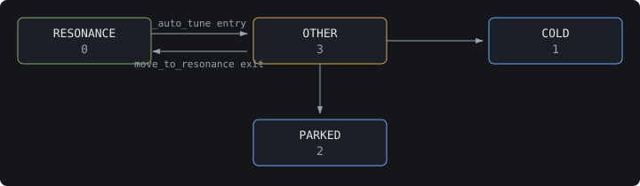

# How auto-tune works

Every frequency-tuning path in `sc_linac_physics` — auto setup, the tuning GUI,
and RF commissioning — converges through one loop: `Cavity._auto_tune()`. This
page explains what that loop commands the hardware to do, lets you drive a
simulated copy of it, and lists how it fails.

## 1. What tuning moves, and with what

Detune is the difference between the cavity's frequency and the frequency we
want. Tuning is the act of driving it to zero.

Two actuators, with a clear division of labor:

|  | Stepper tuner | Piezo |
|---|---|---|
| Speed | Slow — a mechanical move. Roughly 50 s at full range: 1,000,000 usteps at 20,000 usteps/s <span class="cite">`linac_utils.py::DEFAULT_STEPPER_MAX_STEPS, linac_utils.py::DEFAULT_STEPPER_SPEED; STEP:VELO EGU is usteps/`</span> | Fast — a voltage change, not a mechanical move <span class="cite">`piezo.py::Piezo.voltage_pv`</span> |
| Range | Enormous; tens of millions of microsteps to cold landing <span class="cite">`linac_utils.py::stepper_tol_factor “50,000,000 steps for cold landing”`</span> | Narrow, centered at 25 V <span class="cite">`linac_utils.py::PIEZO_CENTER_VOLTAGE`</span> |
| Role | Gets the cavity to resonance and holds the coarse position <span class="cite">`cavity.py::Cavity.move_to_resonance`</span> | Closed-loop frequency feedback, driven off an integrator setpoint <span class="cite">`MODECTRL/MODESTAT, piezo.py::Piezo.feedback_control_pv, piezo.py::Piezo.feedback_stat_pv; INTEG_SP, piezo.py::Piezo.feedback_setpoint_pv`</span> |

!!! warning "Open question: the piezo loop's timescale is not in this repo"

    The code gives a
    closed-loop mode, an integrator setpoint, and a centering pass that runs
    under SELA
    <span class="cite">`INTEG_SP, piezo.py::Piezo.feedback_setpoint_pv; cavity.py::Cavity.move_to_resonance “if use_sela:”`</span>. None of that fixes a bandwidth, and no figure appears anywhere in `src/`.

    CHECK: what is the cutoff in Hz, and does the loop reject microphonics or
    only follow slow drift? Open for the same reason: why the piezo ends up off
    its 25 V center at all. Section 3 shows the correction, not the cause.

### Where Hz-per-step comes from

This is the detail most likely to mislead someone reading the source.
`linac_utils.py` contains `HZ_PER_STEP = 1.4` and `HL_HZ_PER_STEP = 18.3`
<span class="cite">`linac_utils.py::HZ_PER_STEP, linac_utils.py::HL_HZ_PER_STEP`</span>, and it is natural to assume the tuning code uses them. It does not.

The 1.4 is not arbitrary — the prototype tuner measured a slow-tuner
sensitivity of 1.4 Hz/step over a ~450 kHz range
<span class="cite">Pischalnikov et al., IPAC2015, [WEPTY035](https://proceedings.jacow.org/IPAC2015/papers/wepty035.pdf)</span>. The repo calls both constants "very rough values obtained empirically"
<span class="cite">`linac_utils.py “These are very rough values obtained empirically”`</span>, which is the right warning: they are one prototype's numbers, not this
cavity's.

Those two are *estimates*. Nothing in `utils/sc_linac/` or `applications/`
reads either one. Their only consumers are the two derived constants declared
immediately below them
<span class="cite">`linac_utils.py::ESTIMATED_MICROSTEPS_PER_HZ, linac_utils.py::ESTIMATED_MICROSTEPS_PER_HZ_HL`</span>, and the only thing that imports *those* is the simulation IOC
<span class="cite">`utils/simulation/tuner_service.py::StepperPVGroup.hz_per_microstep`</span>. It seeds each simulated cavity's `SCALE` PV at startup, picking the 1.3 GHz
or 3.9 GHz estimate according to the cryomodule and then jittering it uniformly
by ±20 %.

Live tuning ignores all of that and reads a measured, per-cavity number from
the `SCALE` PV:

```text
Cavity.microsteps_per_hz = 1 / StepperTuner.hz_per_microstep   # reads SCALE
```

<span class="cite">`cavity.py::Cavity.microsteps_per_hz, stepper.py::StepperTuner.hz_per_microstep`</span>

Two consequences worth carrying into the rest of this page:

- The conversion factor is a measured property of one cavity. Two cavities in
  the same cryomodule can legitimately disagree, and a stale or wrong `SCALE`
  is a live failure mode — it is the *calibration error* slider in section 2.
- `hz_per_microstep` returns `abs()` of the PV
  <span class="cite">`stepper.py::StepperTuner.hz_per_microstep`</span>. RF
  commissioning measures a *signed* Hz/microstep
  <span class="cite">`phases/frequency_tuning.py::FrequencyTuningPhase._probe_stepper_direction “signed_hz_per_microstep = -delta / probe”`</span>
  and writes it to `SCALE_CALC.B`
  <span class="cite">`phases/frequency_tuning.py::FrequencyTuningPhase._apply_hz_per_step`</span>, but the loop only ever sees the magnitude. Direction of travel comes from
  the sign of the detune, plus the harmonic-linearizer inversion applied inside
  `issue_move_command()`
  <span class="cite">`stepper.py::StepperTuner.issue_move_command “num_steps *= -1”`</span>. So the probe's sign is information for the operator and the commissioning
  record — not an input to the loop.

## 2. The loop

Read the detune, convert Hz to microsteps, move most of the way, read again,
repeat until you are inside tolerance. That is the entire algorithm. Everything
else in `_auto_tune` is a guard against it going wrong.

```text
delta_hz = delta_hz_func()                      # read the machine
expected_steps = |delta_hz * microsteps_per_hz|
tol_factor     = stepper_tol_factor(expected_steps)
tune_config    = OTHER                          # "mid-tune, do not trust me"

while |delta_hz| > tolerance:
    check_abort()
    if stepper_temp > max_stepper_temp:  raise StepperTempError
    iteration_callback()                        # abort flag + live plot
    est_steps = int(0.9 * delta_hz * microsteps_per_hz)
    stepper_tuner.move(est_steps,
                       max_steps = |est_steps| * 1.1,
                       speed     = MAX_STEPPER_SPEED)
    if steps_moved > expected_steps * tol_factor:  raise DetuneError
    check_detune()                              # may widen the chirp range
    delta_hz = delta_hz_func()                  # read the machine again
```

<span class="cite">`cavity.py::Cavity._auto_tune`</span>

### Drive it

[Drive the auto-tune loop](widgets/auto_tune_sim.html)

### Two things the trace will not tell you

**Truncation means a perfect cavity lands a hair outside tolerance.**
`est_steps` is an `int(...)`, and 0.9 leaves a tenth of the detune behind — so
a perfectly calibrated cavity starting at exactly ten times tolerance is aimed
precisely at the tolerance boundary, and the truncated step always drops it
just outside. Set the starting detune to
<span data-fig="fig-example-detune">500</span> Hz with tolerance 50 and
calibration error 1.0: the exact aim is
<span data-fig="fig-exact-aim">81,818.18</span> microsteps, which would leave
the detune sitting exactly on the tolerance and end the loop. `int()` hands the
motor <span data-fig="fig-truncated-aim">81,818</span> instead, and the
<span data-fig="fig-dropped-microsteps">0.18</span> of a microstep it drops
leaves <span data-fig="fig-residual">50.0010</span> Hz — still `> 50`, so a
second move runs. At the nominal `HZ_PER_STEP / MICROSTEPS_PER_STEP` scale of
1.4/256 (linac_utils.py::MICROSTEPS_PER_STEP, linac_utils.py::HZ_PER_STEP) the
same arithmetic leaves <span data-fig="fig-residual-nominal">50.0039</span> Hz.
A well-calibrated cavity at ten times tolerance therefore costs two moves,
never one.

**Converging is not the same as being allowed to finish, and the headroom
shrinks as detune grows.** Each move multiplies the remaining detune by
`|1 - gain|`, so the loop's total travel is a geometric series — and it is
scale-free:

```text
travel / expectedSteps = undershoot / (1 - |1 - gain|)     <- no detune in it
budget / expectedSteps = stepper_tol_factor(expectedSteps)  <- shrinks as detune grows
```

The travel a given miscalibration demands does not care how far out of tune you
started. The budget does. At the page defaults,
<span data-fig="fig-example-detune-b">500</span> Hz is
<span data-fig="fig-example-expected">90,909</span> expected steps and buys a
<span data-fig="fig-example-tol-factor">2.753</span>× budget, while the
<span data-fig="fig-opened-detune">5000</span> Hz the page opens on is
<span data-fig="fig-opened-expected">909,090</span> steps and buys only
<span data-fig="fig-opened-tol-factor">1.376</span>×. (At the nominal 1.4/256
scale those same two figures are
<span data-fig="fig-example-tol-factor-nominal">2.738</span>× and
<span data-fig="fig-opened-tol-factor-nominal">1.369</span>×.) So the further
out of tune a cavity starts, the less calibration error the loop tolerates.
From that opening detune, undershoot 0.9 survives a true/believed scale ratio
up to about <span data-fig="fig-window-undershoot">1.49</span>× and undershoot
1.0 only to about <span data-fig="fig-window-unity">1.27</span>×. That is what
the 0.9 is really buying: budget headroom, not just mathematical stability.
From the same detune a gain of 1.8 converges in principle — `|1 - 1.8| < 1` —
and still trips the runaway guard at every undershoot the slider offers.

Check it above: at the opening detune, calibration error 1.35 converges at
undershoot 0.9 and runs away at 1.0 — it sits inside the first window and
outside the second. Same hardware, same miscalibration; the only difference is
that one factor.

!!! note "What this simulator is not"

    The modeled cavity responds linearly and
    without noise. The real tuner does not: the prototype measured ~30 steps of
    backlash and ~45 Hz of hysteresis over a ±150 Hz range
    <span class="cite">Pischalnikov et al., IPAC2015, [WEPTY035](https://proceedings.jacow.org/IPAC2015/papers/wepty035.pdf)</span>, which is why the tolerance factors are far wider than a linear response
    needs — 5× the estimated steps below 10,000 steps, 1.01× near cold landing,
    fitted empirically against large dead zones
    <span class="cite">`linac_utils.py::stepper_tol_factor`</span>. Trust the
    loop structure here; do not trust the smoothness.

## 3. Where the detune number comes from

`_auto_tune` does not read the machine itself — it calls a `delta_hz_func`
handed to it, and is indifferent to where the number came from. There are two
sources.

|  | Chirp mode | SELA mode |
|---|---|---|
| Detune PV | `CHIRP:DF` | `DFBEST` |
| Piezo feedback | Disabled, DC setpoint 0 V | Enabled |
| Drive level | `SAFE_PULSED_DRIVE_LEVEL` = 10 | Unchanged |
| Settling | RF on, 5 s wait, then find a valid chirp range | RF on |
| Used by | Tuning GUI, RF commissioning | **Auto setup only** |

<span class="cite">`cavity.py::Cavity.setup_tuning`</span>

**SELA tuning has exactly one caller.** `move_to_resonance(use_sela=True)` is
invoked from
`applications/auto_setup/backend/setup_cavity.py::SetupCavity.request_ramp “self.move_to_resonance(use_sela=True)”`
and nowhere else. The tuning GUI and the RF commissioning phase both tune in
chirp mode. SELA appears on this page because it explains the piezo-centering
pass below — not because you will meet it in commissioning.

### The second pass (SELA only)

After converging on detune, `move_to_resonance` runs `_auto_tune` a *second*
time — against `delta_piezo` rather than detune, with tolerance `5 × hz_per_v`
<span class="cite">`cavity.py::Cavity.move_to_resonance “if use_sela:”`</span>.

What that second pass is nulling: `delta_piezo` is the piezo's own offset from
its 25 V center, converted to Hz — literally `(piezo.voltage - 25) × hz_per_v`, negated for harmonic linearizers
<span class="cite">`cavity.py::Cavity.delta_piezo`</span>. Driving that to
zero with the stepper walks the piezo voltage back toward center, so the
stepper ends up holding the offset instead of the piezo.

### Tolerances

50 Hz, or 500 Hz for harmonic linearizers — a literal in the
`move_to_resonance` call, not derived from anything
<span class="cite">`cavity.py::Cavity.move_to_resonance “500 if self.cryomodule.is_harmonic_linearizer else 50”`</span>.

### Yes, the chirp range gets re-adjusted mid-tune

Worth knowing, because it means the chirp range at the end of a tune is not
necessarily the one `setup_tuning` established. `_auto_tune` calls
`check_detune()` after *every* stepper move. If the detune has gone invalid and
the cavity is in chirp mode, that widens the sweep by 1.1× and retries
<span class="cite">`cavity.py::Cavity._auto_tune “self.check_detune()”, cavity.py::Cavity.check_detune`</span>. In SELA there is no range to widen, so it fails hard instead.

Both entry points are safe. `find_chirp_range` normalizes its argument with
`abs(int(...))` before doing anything else
<span class="cite">`cavity.py::Cavity.find_chirp_range “chirp_range = abs(int(chirp_range))”`</span>, so the negative value that `check_detune()` passes in — `chirp_freq_start` is
negative by construction
<span class="cite">`cavity.py::Cavity.set_chirp_range`</span> — is folded to a
magnitude first. The recursion therefore widens and caps on the same number,
stopping at ±400 kHz whether it was entered from `setup_tuning()` or from
inside the tuning loop, and raising `DetuneError` if no valid detune turned up
by then <span class="cite">`cavity.py::Cavity.find_chirp_range`</span>.

## 4. Tune states

Every cavity carries a `TUNE_CONFIG` PV asserting what its frequency currently
means
<span class="cite">`linac_utils.py::TUNE_CONFIG_RESONANCE_VALUE, linac_utils.py::TUNE_CONFIG_COLD_VALUE, linac_utils.py::TUNE_CONFIG_PARKED_VALUE, linac_utils.py::TUNE_CONFIG_OTHER_VALUE`</span>.



| State | What it asserts | Written by |
|---|---|---|
| `RESONANCE` (0) | On resonance, ready for beam | `move_to_resonance()` on success <span class="cite">`cavity.py::Cavity.move_to_resonance “put(linac_utils.TUNE_CONFIG_RESONANCE_VALUE)”`</span> |
| `COLD` (1) | At the cold landing frequency | Cold-landing tooling |
| `PARKED` (2) | Stepper parked at a defined reference | Parking tooling |
| `OTHER` (3) | Mid-transition or unknown — do not trust the frequency | `_auto_tune()` on entry <span class="cite">`cavity.py::Cavity._auto_tune “put(linac_utils.TUNE_CONFIG_OTHER_VALUE)”`</span> |

!!! note "A cavity that dies mid-tune is left in OTHER, and that is correct"

    `_auto_tune` writes `OTHER` as its first act, but only `move_to_resonance`
    writes `RESONANCE` on the way out. Any failure in between — runaway, over
    temp, abort, invalid detune — leaves the state at `OTHER`, which is an
    honest report that nobody knows where the cavity is.

### Two cold-landing numbers, easily conflated

|  |  |
|---|---|
| `DF_COLD` | The reference *detune*, in Hz, at cold landing <span class="cite">`cavity.py::Cavity.df_cold_pv`</span> |
| `NSTEPS_COLD` | The signed *step count* for the return trip, resonance back to cold landing — a distance, not a position <span class="cite">`stepper.py::StepperTuner.steps_cold_landing_pv, phases/frequency_tuning.py::FrequencyTuningPhase._write_cold_landing_steps`</span> |

## 5. The commissioning stages

RF commissioning wraps the same loop in a gated, operator-supervised sequence
<span class="cite">`phases/frequency_tuning.py::FrequencyTuningPhase.get_phase_steps`</span>. Seven steps:

| # | Step | What it does to the machine |
|---|---|---|
| 1 | `verify_initial_state` | Confirms the stepper is idle, then prepares the cavity: SSA on, interlocks reset, `setup_tuning()` into chirp mode |
| 2 | `record_cold_landing` | Records the cold-landing detune; the operator pushes it to `DF_COLD` from the UI |
| 3 | `probe_stepper_direction` | Moves ±50,000 microsteps and measures the detune response |
| 4 | `apply_hz_per_step` | Writes the confirmed Hz/full-step to `SCALE_CALC.B` |
| 5 | `tune_to_resonance` | Delegates to `_auto_tune` with a temperature guard, then writes `NSTEPS_COLD` |
| 6 | `measure_pi_modes` | Single-cavity FSCAN for the 8π/9 and 7π/9 parasitic modes |
| 7 | `record_results` | Writes the phase record to the commissioning database |

### What this path does that `move_to_resonance` does not

- **Measures Hz/microstep instead of inheriting it.** A 50,000-microstep probe
  move must produce at least 100 Hz of detune change
  <span class="cite">`phases/frequency_tuning.py::FrequencyTuningLimits.min_probe_delta_hz, enforced phases/frequency_tuning.py::FrequencyTuningPhase._probe_stepper_direction “abs(delta) < self.limits.min_probe_delta_hz”`</span>. Below that it fails and points at the physical cause: the stepper is not
  mechanically connected to the tuner.
- **Applies an explicit sign convention.**
  `SCALE = -Δ(CHIRP:DF) / Δ(microstep)`: a positive number of microsteps
  *decreases* `CHIRP:DF`
  <span class="cite">`phases/frequency_tuning.py::FrequencyTuningPhase._probe_stepper_direction “A positive number of microsteps decreases CHIRP:DF”`</span>.
- **Waits for the operator before writing.** And it writes `SCALE_CALC.B`, not
  `SCALE` — `SCALE` is a read-only calc output the IOC recomputes from it
  (`SCALE = SCALE_CALC.B / 256`), so writing `SCALE` directly is silently
  reverted
  <span class="cite">`stepper.py::StepperTuner.set_hz_per_microstep, phases/frequency_tuning.py::FrequencyTuningPhase._apply_hz_per_step “STEP:SCALE is a derived, read-only calc-record output”`</span>.
- **Refuses to tune until `DF_COLD` is pushed** and matches the recorded
  cold-landing frequency within 1 Hz
  <span class="cite">`phases/frequency_tuning.py::FrequencyTuningPhase._check_df_cold_recorded, tolerance at phases/frequency_tuning.py::FrequencyTuningPhase._DF_COLD_MATCH_TOLERANCE_HZ`</span>. The reason it compares against the record rather than checking validity:
  `DF_COLD` defaults to a perfectly valid 0, so there is no INVALID severity to
  key off.
- **Guards the stepper temperature** at `STEPPER_TEMP_LIMIT` = 70 *kelvin*
  <span class="cite">`phases/frequency_tuning.py::FrequencyTuningLimits.temp_limit_k`</span>, raisable for a re-run by an explicit operator acknowledgement
  <span class="cite">`phases/frequency_tuning.py::FrequencyTuningPhase._tune_to_resonance “parameters.get("over_temp_ack_k")”`</span>. The raised ceiling is passed straight into `_auto_tune`'s
  `max_stepper_temp`, which still fails hard on a breach — the acknowledgement
  moves the line, it does not add a retry.

  Kelvin, despite the `_c` on those names and the `°C` in `StepperTempError`'s
  message. The stepper sits in the cryomodule insulating vacuum: production
  testing interlocks the motor below 70 K and reports it starting near 30 K and
  rising under 4 K through a long motion
  <span class="cite">Holzbauer et al., IPAC2018, [WEPML004](https://proceedings.jacow.org/IPAC2018/papers/wepml004.pdf)</span>. The simulation agrees, serving `STEPTEMP` at 35.0 with its alarm at 70
  <span class="cite">`cavity_service.py::CavityPVGroup.step_temp`</span>. The
  number is right and the label is wrong.

!!! note "Not covered here: the operator controls"

    This section describes the
    backend phase logic only. The screen that drives it now exists — a
    1,700-line controller
    <span class="cite">`ui/controllers/frequency_tuning_controller.py`</span>
    plus three re-run gates that re-establish cavity state before stages 2, 3
    and 4
    <span class="cite">`phases/frequency_tuning.py::FrequencyTuningPhase._check_state_for_stage_2, phases/frequency_tuning.py::FrequencyTuningPhase._check_state_for_stage_3, phases/frequency_tuning.py::FrequencyTuningPhase._check_state_for_stage_4`</span>
    — and it is deliberately out of scope for a page about the convergence
    loop. Section 6 covers the abort *mechanism* at the stepper and cavity
    level, which is what `_auto_tune` itself sees.

## 6. How it fails

The last column names the fault to pick from *Inject a fault* in the section 2
simulator, so you can watch the loop react.

| Failure | Raises | Cause and what to do | Simulator fault |
|---|---|---|---|
| Step budget exceeded | `DetuneError` | `SCALE` is miscalibrated, or the tuner is slipping mechanically. The loop asked for more steps than `stepper_tol_factor` allows for the detune it started with. If the reported detune never changed across the whole run, the message says so — that distinguishes a tuner that is mechanically stuck while still reporting motion from honest over-travel. | `slip` |
| Step estimate rounds to zero | `DetuneError` | `SCALE` is implausibly large, so `int(0.9 × delta_hz × microsteps_per_hz)` truncates to 0 while the detune is still outside tolerance. A zero step commands no motion, so nothing would ever change. The loop raises immediately and names `SCALE` and the offending `hz_per_microstep` <span class="cite">`cavity.py::Cavity._auto_tune “if est_steps == 0:”`</span>. The injection rewrites `SCALE` mid-tune, which is the real route in: the loop re-reads it every iteration, so a bad value written by `_apply_hz_per_step` takes effect on the next move. | `bad_scale` |
| Detune invalid at entry | `DetuneError` | Cavity off, or the chirp range is wrong before the loop even starts. Checked once, before the first move <span class="cite">`cavity.py::Cavity._auto_tune “DetuneError(f"{self} detune invalid")”`</span>. |  |
| Detune invalid mid-loop, chirp | — recovers | `check_detune()` widens the chirp range 1.1× and carries on. See section 3 on the cap. | `detune_invalid_chirp` |
| Detune invalid mid-loop, SELA | `DetuneError` | No range to widen, so it fails hard <span class="cite">`cavity.py::Cavity.check_detune “Cannot tune in SELA with invalid detune”`</span>. Auto setup only. | `detune_invalid_sela` |
| Stepper over temperature | `StepperTempError` | **There is no cool-down and no retry.** The loop raises and stops; a human has to let the motor cool and re-run tuning <span class="cite">`cavity.py::Cavity._auto_tune “Optional stepper motor temperature guard”`</span>. | `hot_motor` |
| Limit switch hit | `StepperError` | Checked after every completed move — the motor stopped for a bad reason rather than because it arrived <span class="cite">`stepper.py::StepperTuner.issue_move_command “if self.on_limit_switch:”`</span>. | `limit_switch` |
| Operator abort, stepper | `StepperAbortError` | Setting `stepper_tuner.abort_flag` stops a move *already in progress*: the polling loop in `issue_move_command` checks it every 5 s while the motor runs, writes 1 to `ABORT_REQ`, and raises. Worst case about 10 s from the request — a 5 s settle sleep before polling starts, plus the 5 s interval <span class="cite">`stepper.py::StepperTuner.check_abort, stepper.py::StepperTuner.issue_move_command “while self.motor_moving:”`</span>. |  |
| Any failure during a move | the original error | `move()` writes `ABORT_REQ` if `MOTOR_MOVING` still reads 1 (or can't be read), then restores `NSTEPS.DRVH` and `VELO` if it changed them, then re-raises <span class="cite">`stepper.py::StepperTuner._clean_up_failed_move`</span>. |  |
| Operator abort, cavity | `CavityAbortError` | Setting `cavity.abort_flag` is the path that also turns the RF *off* — `check_abort()` calls `turn_off()` before it raises <span class="cite">`cavity.py::Cavity.check_abort`</span>. A caller that stops the stepper without setting this leaves the cavity powered. During a move, `StepperTuner.check_abort` writes `ABORT_REQ` before calling it, so the motor stops before the RF-off wait <span class="cite">`stepper.py::StepperTuner.check_abort “if self.cavity.abort_flag:”`</span>. | `abort` |
