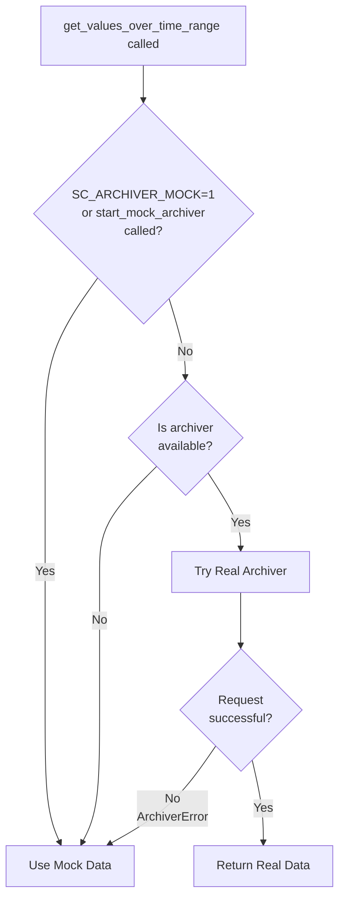

# Archiver Module Documentation

## Overview

The archiver module provides a smart routing wrapper for accessing EPICS archiver data with automatic fallback to mock data generation. It's designed to work seamlessly in both production (with real SLAC archiver) and simulation environments.

## Architecture

### Smart Routing Logic

The module implements a three-tier fallback strategy:

1. **Force Mock Mode**: If `SC_ARCHIVER_MOCK=1` environment variable is set OR `start_mock_archiver()` is called
2. **Availability Check**: Quick connectivity check to the real archiver
3. **Automatic Fallback**: If real archiver fails with any error, automatically fall back to mock

### Module Structure

```
archiver/
├── init.py                  # Public API and routing logic
├── client.py                # Real EPICS Archiver Appliance client
├── mock.py                  # Mock data generator
├── models.py                # Data models (ArchiverValue, ArchiveDataHandler)
└── tests/
    ├── test_archiver_live.py
    ├── test_client.py
    ├── test_mock.py
    ├── test_models.py
    └── test_wrapper.py
```

## Core Components

### 1. Public API (`__init__.py`)

**Main Function:**

```python
get_values_over_time_range(
    pv_list: List[str],
    start_time: datetime,
    end_time: datetime,
) -> Dict[str, ArchiveDataHandler]
```

Fetches historical PV data over a time range. Returns a dictionary mapping PV names to ArchiveDataHandler objects.

**Mock Control:**

- `start_mock_archiver()` - Forces the module to use mock data (called by sc-sim)

**Exposed Utilities:**

- `is_archiver_available()` - Quick connectivity check
- `real_get_values_over_time_range()` - Direct access to real archiver
### 2. Data Models (`models.py`)

**ArchiverValue** (immutable dataclass):

- `value: Union[float, int, str]` - The actual measurement
- `timestamp: datetime` - When the measurement was taken
- `severity: int` - EPICS alarm severity (default 0)
- `status: int` - EPICS status code (default 0)

**ArchiveDataHandler** (mutable dataclass):

- `pv_name: str`
- `values: List[Union[float, int, str]]`
- `timestamps: List[datetime]`
- `severities: List[int]`
- `statuses: List[int]`

Provides a `from_archiver_values()` classmethod to construct from a list of ArchiverValue objects.

### 3. Real Archiver Client (`client.py`)

**Endpoint:** `http://lcls-archapp.slac.stanford.edu/retrieval/data/getData.json`

**Features:**

- HTTP session with retry logic (3 retries on 5xx/429 errors)
- Connection pooling (4 connections, max 8)
- Automatic backoff on failures
- 10-second request timeout

**Error Hierarchy:**

```python
ArchiverError                 # Base exception
├── ArchiverTimeoutError      # Request timed out
└── ArchiverConnectionError   # Cannot connect
```

**Connectivity Check:**

```python
is_archiver_available(timeout: float = 2.0) -> bool
```

Quick HEAD request to check if archiver is reachable (considers <500 status as available).

### 4. Mock Data Generator (`mock.py`)

**MockArchiveDataHandler:**

Generates deterministic, realistic mock data for a single PV based on:

- PV name patterns (ADES, PACT, PDES, DF, CUDSTATUS, etc.)
- Time range
- Configurable sample rate (default 1 Hz)
- Stable seed (same inputs → same output)

**PV-Specific Behavior:**

- **Gradients** (ADES, AACT, GDES, GACT): ~16.5 MV with ±0.1 noise
- **Phases** (PDES, PACT): ~0° with ±0.5° noise
- **Detune** (DF, DETUNE): ~0 Hz with ±10 Hz noise
- **Drive Level** (SEL_ASET): ~0 with ±0.5 noise
- **Fault Codes** (CUDSTATUS): Strings ("TLC" 90%, occasional faults)
- **Default**: 0 with ±0.1 noise

**Realistic Features:**

- 2% chance of fault spikes (5x noise range)
- Slight upward drift over time
- 90% severity=0 (no alarm)
- 95% status=0 (normal)
## Usage Examples

### Basic Usage (Auto-routing)

```python
from sc_linac_physics.utils.archiver import get_values_over_time_range
from datetime import datetime, timedelta

end = datetime.now()
start = end - timedelta(hours=1)

data = get_values_over_time_range(
    pv_list=["ACCL:L1B:0210:ADES", "ACCL:L1B:0210:PDES"],
    start_time=start,
    end_time=end
)

# Access data
ades_handler = data["ACCL:L1B:0210:ADES"]
print(f"Got {len(ades_handler.values)} data points")
print(f"First value: {ades_handler.values[0]} at {ades_handler.timestamps[0]}")
```

### Force Mock Mode

```python
from sc_linac_physics.utils.archiver import start_mock_archiver, get_values_over_time_range

# Enable mock mode (e.g., in sc-sim startup)
start_mock_archiver()

# All subsequent calls use mock data
data = get_values_over_time_range(...)
```

### Environment Variable Control

```bash
# Force mock mode via environment
export SC_ARCHIVER_MOCK=1
python my_script.py
```

## Routing Decision Flow


## Testing

### Test Coverage

- `test_models.py`: Data model instantiation and conversion
- `test_mock.py`: Mock data generation for various PV types
- `test_client.py`: Real archiver connectivity and error handling
- `test_wrapper.py`: Smart routing logic and fallback behavior
- `test_archiver_live.py`: Manual integration test script

### Running Tests

```bash
# Run all tests
pytest tests/test_*.py -v

# Run specific test file
pytest tests/test_wrapper.py -v

# Run with coverage
pytest tests/ --cov=sc_linac_physics.utils.archiver --cov-report=html
```

### Test Fixtures

- `reset_mock_state`: Resets global `_mock_archiver_enabled` flag before/after each test
- `sample_time_range`: Provides standard 1-minute time range for testing