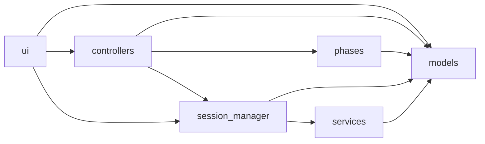

# RF Commissioning Architecture

This document defines package boundaries for
`sc_linac_physics.applications.rf_commissioning`.

## Layers

- `models`: dataclasses, enums, serialization, persistence adapters
- `phases`: phase execution logic and result contracts
- `services`: orchestration and workflow lifecycle
- `session_manager`: application-facing session facade
- `controllers`: UI behavior and phase execution wiring
- `ui`: widgets, dialogs, screens, and presentation helpers

## Dependency Direction

Allowed direction:

1. `models` -> (no internal dependency requirement)
2. `phases` -> `models`
3. `services` -> `models`
4. `session_manager` -> `models`, `services`
5. `controllers` -> `models`, `phases`, `session_manager`
6. `ui` -> `models`, `controllers`, `session_manager`

Disallowed direction examples:

- `models` importing from `ui` or `controllers`
- `services` importing from `ui` or `controllers`
- internal modules importing symbols from package root
  `sc_linac_physics.applications.rf_commissioning`

## Import Rule

Inside `rf_commissioning`, import concrete modules directly.

Prefer:

```python
from sc_linac_physics.applications.rf_commissioning.models.data_models import CommissioningPhase
```

Avoid (inside the same package):

```python
from sc_linac_physics.applications.rf_commissioning import CommissioningPhase
```

Reason: direct imports reduce coupling to `__init__.py` re-exports and lower
the chance of circular import regressions.

## Focused Helper Modules

Recent refactors extracted cohesive UI/controller responsibilities into helper
modules while preserving existing method entry points:

- `controllers/piezo_pre_rf_pv.py`: cavity selection and PV wiring helpers
- `ui/container/progress_panel.py`: compact progress panel build/update logic

This keeps large orchestration classes readable while preserving runtime
behavior and call sites.

## Package Graph



## Guardrail Test

Architecture test:

- `tests/applications/rf_commissioning/test_import_boundaries.py`

The test fails if an internal RF commissioning module imports from package
root re-exports.
